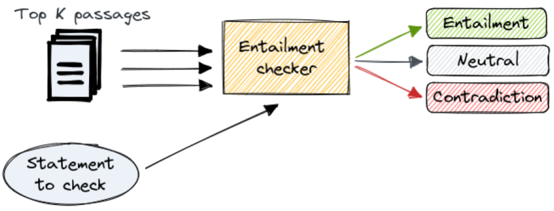

# Haystack Entailment Checker

Custom node for the [Haystack NLP framework](https://github.com/deepset-ai/haystack).
Using a [Natural Language Inference](https://paperswithcode.com/task/natural-language-inference) model, it checks whether a lists of Documents/passages entails, contradicts or is neutral with respect to a given statement.

**Live Demo**: Fact Checking 🎸 Rocks! &nbsp; [](https://huggingface.co/spaces/anakin87/fact-checking-rocks)

## How it works

- The node takes a list of Documents (commonly returned by a [Retriever](https://docs.haystack.deepset.ai/docs/retriever)) and a statement as input.
- Using a Natural Language Inference model, the text entailment between each text passage/Document (premise) and the statement (hypothesis) is computed. For every text passage, we get 3 scores (summing to 1): entailment, contradiction and neutral.
- The text entailment scores are aggregated using a weighted average. The weight is the relevance score of each passage returned by the Retriever, if availaible. It expresses the similarity between the text passage and the statement. **Now we have a summary score, so it is possible to tell if the passages confirm, are neutral or disprove the user statement.**
- *empirical consideration: if in the first N passages (N<K), there is strong evidence of entailment/contradiction (partial aggregate scores > **threshold**), it is better not to consider (K-N) less relevant documents.*

## Installation
```bash
pip install haystack-entailment-checker
```

## Usage
### Basic example
```python
from haystack import Document
from haystack_entailment_checker import EntailmentChecker

ec = EntailmentChecker(
        model_name_or_path = "microsoft/deberta-v2-xlarge-mnli",
        use_gpu = False,
        entailment_contradiction_threshold = 0.5)

doc = Document("My cat is lazy")

print(ec.run("My cat is very active", [doc]))
# ({'documents': [...],
# 'aggregate_entailment_info': {'contradiction': 1.0, 'neutral': 0.0, 'entailment': 0.0}}, ...)
```

### Fact-checking pipeline (Retriever + EntailmentChecker)
```python
from haystack import Document, Pipeline
from haystack.nodes import BM25Retriever
from haystack.document_stores import InMemoryDocumentStore
from haystack_entailment_checker import EntailmentChecker

# INDEXING
# the knowledge base can consist of many documents
docs = [...]
ds = InMemoryDocumentStore(use_bm25=True)
ds.write_documents(docs)

# QUERYING
retriever = BM25Retriever(document_store=ds)
ec = EntailmentChecker()

pipe = Pipeline()
pipe.add_node(component=retriever, name="Retriever", inputs=["Query"])
pipe.add_node(component=ec, name="EntailmentChecker", inputs=["Retriever"])

pipe.run(query="YOUR STATEMENT TO CHECK")
```
## Acknowledgements 🙏
Special thanks goes to [@davidberenstein1957](https://github.com/davidberenstein1957), who contributed to the original implementation of this node, in the [Fact Checking 🎸 Rocks!](https://github.com/anakin87/fact-checking-rocks) project.